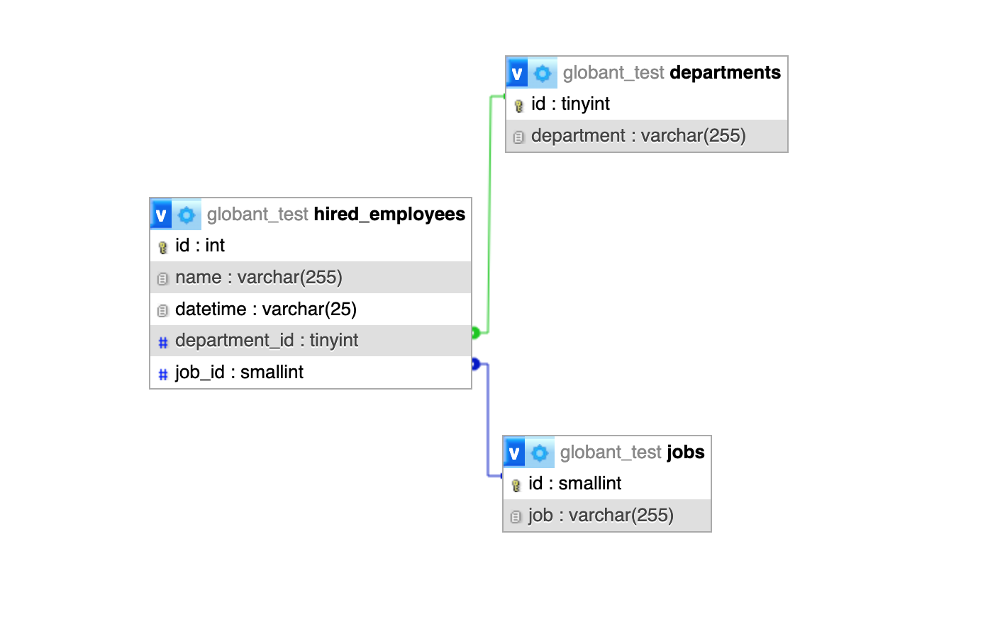

# Flask REST API with MySQL

This is a simple Flask-based REST API project that needs to:
1.	Receive historical data from CSV files
2.	Upload these files to the new DB
3.	Be able to insert batch transactions (1 up to 1000 rows) with one request

## Table of Contents

- [Getting Started](#getting-started)
  - [Prerequisites](#prerequisites)
  - [Installation](#installation)
- [Usage](#usage)
  - [Running the API](#running-the-api)
  - [Endpoints](#endpoints)
  - [Endpoints SQL](#endpoints-sql)
- [Thanks for passing by](#thanks-for-passing-by)


## Getting Started

These instructions aim to assist anyone in running and testing the project locally. If you are not familiar with RDBMS, you can still proceed; however, you will likely need to refer to other tutorials, as you will require a running instance of a local database server to observe the API's functionality.

### Prerequisites

You need to have the following software installed:

- Python (>=3.6)
  - will be provided a requirements.txt
- MySQL Server (also recommend SQLite and PostgreSQL)
    - Server must be running on localhost
    - DB structure will be provided considering a MySQL RDMS

### Installation

1. Clone the repository
```bash
   git clone https://github.com/erick-efc/globant_test_flask_rest_api
   cd globant_test_flask_rest_api
```
2. Create and activate a virtual environment (optional but highly recommended):
```bash
  python3 -m venv venv
  source venv/bin/activate
```

3. Install required packages:
```bash
  pip install -r requirements.txt
```

4. Set up the DB (we will use MySQL, as exaplained) 
- open a new terminal and start an instance of MySQL with admin access:
``` bash
mysql -u root -p
```
- build the DB using the provided empty sql dump file `db_structure.sql`
``` sql
source ./misc/db_structure.sql;
```
  -You should have something like this:


- create a new user to interact with you api. To interact with this app without need to change config, you can you use:
``` sql
CREATE USER 'api_user'@'localhost' IDENTIFIED BY 'globant123';
```
- grant the access to the new user accordingly
``` sql
GRANT SELECT, INSERT, UPDATE, DELETE ON globant_test.* TO 'api_user'@'localhost';
```
- flush
``` sql
FLUSH PRIVILEGES;
```
- optional you can run a phpMyAdmin instance to follow the api interacting with the DB, run in another terminal and access `http://localhost:8080/index.php` trough browser:
``` bash
php -S localhost:8080
```

## Usage

### Running the API
  Keep in mind to execute the following instructions with the virtual environment running
  ``` bash
  flask run
  ```
  if you want to, you can run the `run.py` that has `debug=True` set
  ``` bash
  python run.py
  ```

### Endpoints

- `POST /api/upload_hist` Uploads CSV files to `historical_upload` directory, especifically the historic data for the DB, you can also access this CSVs in the `historical_data_bkup`, you need to specify a file with this request eg.:
``` bash
curl -X POST -F "file=@hired_employees.csv" http://localhost:5000/api/upload_hist
```
- `POST /api/historical_to_db` Update the DB with historical data uploaded through the previous endpoint, takes no arguments eg.:
``` bash
curl -X POST http://localhost:5000/api/historical_to_db
```
- `POST /api/batch_insert` Receives a batch transaction in json format, you must indicate the table name to receive the update. Keep in mind that the DB sctructure has constraints, you cannot update a child with foreigns keys missing from its parents, here is a example of usage of this endpoint: 
``` bash
curl -X POST \
  http://localhost:5000/api/batch_insert \
  -H 'Content-Type: multipart/form-data' \
  -F 'table_name=departments' \
  -F 'rows=[
        ["13", "Advanced RnD"],
        ["14", "Nuclear Powerplant"]
    ]'
 ```
 - `POST /api/historical_data_bkup_feed` It retrieves the historical data backup from the server, takes no arguments eg.:
 ``` bash
 curl -X POST -F "file=@hired_employees.csv" http://localhost:5000/api/historical_data_bkup_feed
 ```
 - `POST /api/upload` Upload a persistent file to Uploads folder, needs to specify a file eg.:
 ``` bash
  curl -X POST -F "file=@hired_employees.csv" http://localhost:5000/api/upload
```
- `POST /api/update_db_csv` It takes a local file to update directly the DB, with non persistency for the file, needs to specify a file eg.:
``` bash
curl -X POST -F "file=@hired_employees.csv" http://localhost:5000/api/update_db_csv
```
- `GET /api/ls_uploads` It retrieves a list of files in the uplaods folder eg.:
``` bash
curl -X GET http://localhost:5000/api/ls_uploads
```
- `POST /api/del_in_uploads` Deletes specific files in the uploads folder, requires a filename as file eg.:
``` bash
curl -X POST -F "file=hired_employees.csv" http://localhost:5000/api/del_in_uploads
```
### Endpoints SQL
- `GET /api/sql/hired_over_mean_2021` Query deaprtments with hired employees above mean of the company in json format. So retrieve it in tabulate format you can run `tabulated_hired_over_mean_2021.py`
``` bash
python ./utils/tabulated_hired_over_mean_2021.py
```
- `GET /api/sql/tabulated_employee_count_by_quarter` Query deaprtments with hired employees above mean of the company in json format. So retrieve it in tabulate format you can run `tabulated_employee_count_by_quarter.py`
``` bash
python ./utils/tabulated_employee_count_by_quarter.py
```

# Thanks for passing by!
- Feel free to add my in [Linkedin](https://www.linkedin.com/in/-ec-)